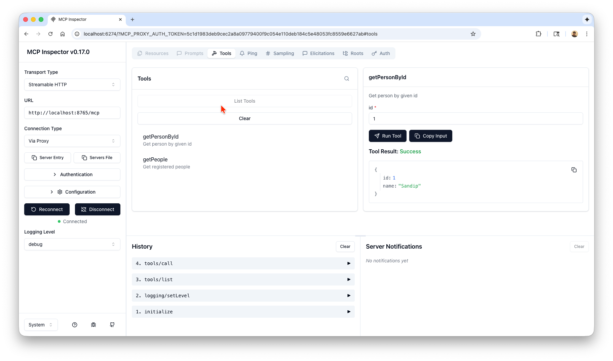

# api-mcp

A simple MCP Server and Client using Spring AI

It basically demonstrates how to implement a MCP server that can sit side dby side with api '/api/people' in this case.

# Server App (`com.apple.ai.mcp.api_mcp.server.ApiMcpApplication` )

Provides a single tool:

```text
Tool[name=getPeople, description=Get registered people, inputSchema=JsonSchema[type=object, properties={}, required=[], additionalProperties=false, defs=null, definitions=null]]
```

See [application-server.yaml](src/main/resources/application-server.yaml) for MCP server configuration.

# Client App ( `com.apple.ai.mcp.api_mcp.client.ApiMcpClientApplication` )

Create a MCP client that can talk to the MCP server above, list tools and call them.

See [application-client.yaml](src/main/resources/application-client.yaml) for MCP server configuration.

## Sample Client run

```text
API MCP Client Application
Client: Implementation[name=api-mcp-server-client - api-mcp-server, version=1.0.0]
Calling with args:  {id=1} Tool[name=getPersonById, description=Get person by given id, inputSchema=JsonSchema[type=object, properties={id={type=integer, format=int32}}, required=[id], additionalProperties=false, defs=null, definitions=null]]
Tool result: 
[TextContent[audience=null, priority=null, text={"id":1,"name":"Sandip"}]]
Calling with args:  {} Tool[name=getPeople, description=Get registered people, inputSchema=JsonSchema[type=object, properties={}, required=[], additionalProperties=false, defs=null, definitions=null]]
Tool result: 
[TextContent[audience=null, priority=null, text=[{"id":1,"name":"Sandip"},{"id":2,"name":"Tim"}]]]
```

## Using MCP Inspector

You can also run, configure and use MCP Inspector tool from anthropic:

### Run MCP Inspector

```bash
$ node --version
v23.6.1
$ npx @modelcontextprotocol/inspector
Starting MCP inspector...
⚙️ Proxy server listening on localhost:6277
🔑 Session token: 1c54561452d5e1136bd90dbaf655315894791dd27a3d7b8dde7d9a093b7500cc
   Use this token to authenticate requests or set DANGEROUSLY_OMIT_AUTH=true to disable auth

🚀 MCP Inspector is up and running at:
   http://localhost:6274/?MCP_PROXY_AUTH_TOKEN=1c54561452d5e1136bd90dbaf655315894791dd27a3d7b8dde7d9a093b7500cc
```
Once it is running configure and use it like this:



The Bearer token value from above example run is `1c54561452d5e1136bd90dbaf655315894791dd27a3d7b8dde7d9a093b7500cc`

As you can see you can list and even invoke the tools.